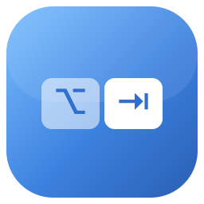

<p align="center">
  
</p>

<h1 align="center">OpenTab</h1>

A free, open-source, MIT-licensed **AltTab-style window switcher for macOS**.
Hold <kbd>⌥ Option</kbd> and press <kbd>⇥ Tab</kbd> to cycle through your open
windows; release Option to focus the highlighted one.

> Status: cross-Space switching, window titles, hold-to-repeat and a settings
> window all work. Live thumbnails and in-switcher search are on the roadmap.

## Features

Working now:
- Window cycling across **all Spaces** — <kbd>⌥</kbd>+<kbd>⇥</kbd> forward, <kbd>⌥⇧</kbd>+<kbd>⇥</kbd> backward
- **Hold** the key to auto-repeat; <kbd>Esc</kbd> cancels without switching
- Real window titles (via Accessibility + Screen Recording for other Spaces)
- Focuses the exact window and switches to its Space, **full-screen included**
- Duplicate/tab folding so each real window appears once
- **Real MRU ordering** (windows ordered by actual recent use)
- **Settings** (menu bar → Settings…, or <kbd>⌘</kbd>+<kbd>,</kbd>):
  - **View** — app grid, list, or one entry per app · **Density** — normal / compact
  - **Scope** — all screens or active screen · minimized / hidden-app toggles
  - **Rebindable shortcut** · live permission & status readout
- Menu-bar item, no Dock icon

Roadmap:
- Live window thumbnails in the grid
- Type-to-filter (fuzzy search) while the switcher is open
- Mouse (hover/click) and arrow-key navigation
- Act on the highlighted window (close / quit / minimize)

## Build from source

Requires macOS 13+ and the Swift toolchain (Xcode or Command Line Tools).

```bash
git clone https://github.com/tburkhalterr/OpenTab.git
cd OpenTab
make run          # builds OpenTab.app and launches it
```

Other targets: `make build` (SPM only), `make app` (assemble the bundle),
`make test`, `make lint` (SwiftLint — `brew install swiftlint`), `make clean`.
CI (`.github/workflows/swift.yml`) runs lint + build + tests on every push/PR.

On first launch macOS will ask for **Accessibility** permission
(System Settings → Privacy & Security → Accessibility). Grant it, then relaunch.

### Keep the permission across rebuilds (dev)

Unsigned apps get a new code identity on every build, so macOS re-asks for
Accessibility each time. Sign with a stable self-signed certificate once:

```bash
make cert   # creates a "OpenTab Dev" code-signing certificate (one time)
make run    # now signed with a stable identity — grant Accessibility once
```

After this, rebuilds reuse the same identity and the grant sticks.

## Install with Homebrew

Once a release is published:

```bash
brew install --cask tburkhalterr/tap/opentab
```

### Cutting a release

```bash
make release        # builds, zips OpenTab.app, prints version + sha256
```

Then:
1. `gh release create v<version> OpenTab-<version>.zip --generate-notes`
2. Paste the printed `version` / `sha256` into `Casks/opentab.rb`
3. Push `Casks/opentab.rb` to a `tburkhalterr/homebrew-tap` repo

> For a public release that passes Gatekeeper on other Macs, sign with a
> **Developer ID** identity and **notarize** (`xcrun notarytool`) before zipping.
> The bundled `make` flow uses a self-signed dev cert, which only suits your own
> machine.

## Architecture

| File | Responsibility |
|------|----------------|
| `main.swift` | App entry point, accessory (agent) activation policy |
| `AppDelegate.swift` | Permission gate + auto-recovery, hot-key wiring, menu bar |
| `HotKeyManager.swift` | Global hot keys via Carbon `RegisterEventHotKey` |
| `SwitcherController.swift` | Session state: build list, key-state polling, commit/cancel |
| `SwitcherPanel.swift` | The borderless HUD panel and its cells |
| `WindowManager.swift` | Enumerate windows (`CGWindowList` + AX) and focus them |
| `MRUTracker.swift` | Most-recently-used ordering via focus observers |
| `AX.swift` | Shared Accessibility helpers + the private window-id symbol |
| `ActiveScreen.swift` | Screen under the pointer (panel position + scope) |
| `Preferences.swift` | `Preferences` model + observable persisted store |
| `SettingsView.swift` / `SettingsWindowController.swift` | SwiftUI settings + its window |
| `ShortcutRecorder.swift` / `ShortcutFormatting.swift` | Shortcut capture + glyph formatting |
| `AppStatus.swift` | Observable health flags shown in Settings |

## License

MIT — see [LICENSE](LICENSE).
